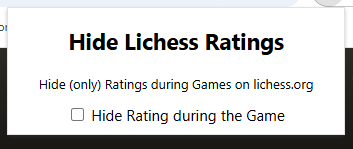
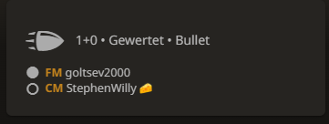
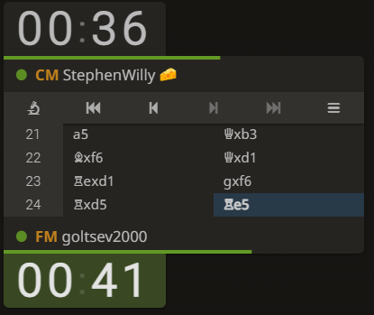
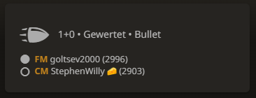
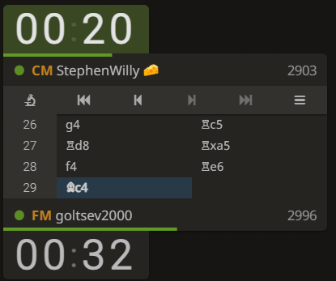

# Hide Lichess Ratings

**Focus on your gameplay and stop adjusting your play based on your opponent's rating.**

A Chrome browser extension that hides ratings on [lichess.org](https://lichess.org), so you can concentrate purely on the chess.

## Features

- Hides opponent ratings next to the clock and under the game mode
- Simple toggle to enable/disable rating hiding
- Automatically refreshes the Lichess tab when toggled
- Lightweight — no unnecessary permissions

## Installation

Since this extension is not published on the Chrome Web Store, you need to install it manually:

1. Clone or download this repository
2. Open Chrome and navigate to `chrome://extensions`
3. Enable **Developer Mode** (toggle in the top-right corner)
4. Click **Load unpacked** and select the extension folder

## Usage

1. Click the extension icon in your browser toolbar to open the popup
2. Check or uncheck **"Hide Rating during the Game"** to toggle rating visibility
3. Any open Lichess tab will automatically refresh to apply the change

||
|:--:|
|*Extension popup*|

## Screenshots

### Ratings Hidden (Extension Enabled)

|||
|:--:|:--:|
|*Game mode*|*Clock & moves*|

### Ratings Visible (Extension Disabled)

|||
|:--:|:--:|
|*Game mode*|*Clock & moves*|

## Contributing

Found a bug? Feel free to open an issue — please include screenshots so the problem is easy to reproduce.

## License

See [LICENSE](LICENSE) for details.
