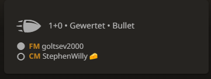
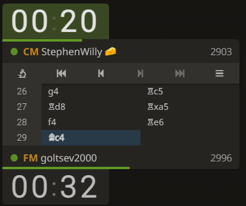

# lichess-hide-rating-extension

<b>Focus on your Gameplay and prevent different play based on the Rating of your opponent</b>

Chrome Browser Extension to hide the opponent rating during games

Toggle between Removing and Displaying Lichess Ratings during your Game while keeping all the other information 

Easy to use UI

| |
|:--:|
| UI |

# Enabled

| |
|:--:|
| Gamemode |

| |
|:--:|
| Time and Moves |

# Disabled

| |
|:--:|
| Gamemode |

| |
|:--:|
| Time and Moves |

# Contributing

If you are able to detect an issue feel free to create an issue. Please add screenshots when doing so.